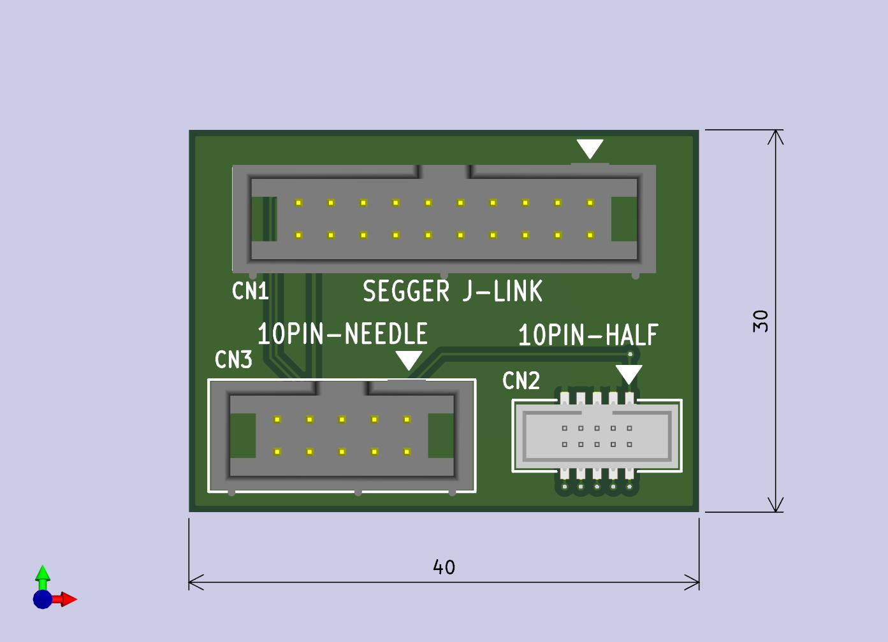

# SEGGER J-LINK用ケーブルアダプタ

この基板は、SEGGER社製 デバッグプローブ J-LINKの接続ケーブルの変換アダプタ基板です。 J-LINKからターゲット基板に接続するためのコネクタおよびケーブルは、0.1インチ、20ピンのケーブルが使用されています。ターゲット基板に ハーフピッチの 10ピンコネクタが実装、または 10ピンニードルアダプタ用パッドが使用されている場合に、ターゲットに合わせたケーブルに変換して使用できるようにすることを目的としたものです。ターゲット基板にあわせて、どちらかにケーブルを接続してください。
J-LINKでのピン配置情報を元に設計していますが、 ARMマイコン用の JTAG/SWD プローブは、どの製品も基本的に同じピン配列になっています。SEGGER社製 J-LINK以外でも使えるはずですが、確認はしていません。

## 構成
この基板は、J-LINKへ接続するための 3つのコネクタが実装されています。 ケーブル類は、付属しませんので、ユーザ側で準備する必要があります。

* 20-Pinコネクタ
    * J-LINKへ接続する 20ピンフラットケーブルを接続するためのコネクタです
* 10-Pinコネクタ (0.1インチピッチ)
    * ターゲットへ接続する 10-Pin Needle Adapter のケーブルを接続するためのコネクタです
* 10-Pinコネクタ (ハーフピッチ)
    * ターゲットへ接続する ハーフビッチの 10ピンフラットケーブルを接続するためのコネクタです

## 使用方法
20ピンコネクタ側をフラットケーブルを使って J-LINKと接続します。ケーブルは J-LINKに付属のものなどを使用してください。
ターゲットとは 10pin Needle Adapter または 10pin ハーフピッチコネクタの いずれか適合する側を利用して接続します。

注意: 10ピン ハーフピッチコネクタには 7番ピンがあります。 フラットケーブルコネクタの 7番ピンにキーピンがある場合、挿入できませんから、キーピンを抜いてから使用してください。ケーブルの向きに注意してください。コネクタの 1番ピン側に ▲マークがあります。

10pin Needle Adapter と 10pinハーフピッチは、ピン配置に互換性がありませんので、注意してください。

## 参考
* [SEGGER社 J-LINKシリーズ ](https://www.segger.com/products/debug-probes/j-link/)
    * [9-Pin Cortex-M Adapter](https://www.segger.com/products/debug-probes/j-link/accessories/adapters/9-pin-cortex-m-adapter/)
    * [10-Pin Needle Adapter](https://www.segger.com/products/debug-probes/j-link/accessories/adapters/10-pin-needle-adapter/)
    10-Pin Needle Adaper には J-LINK接続用のアダプタ基板も付属しているようです。

## 基板外観図

