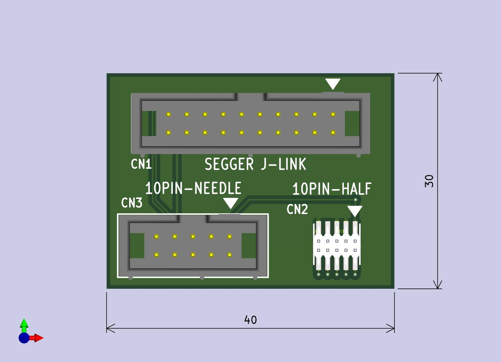

# SEGGER J-LINK用ケーブルアダプタ

この基板は、SEGGER Microcontroller (以降 SEGGER と略記)社製 デバッグプローブ J-LINKの接続ケーブルの変換アダプタ基板です。
(非純正品。ケーブル類は付属しません。SEGGER社等 メーカー・商社等からのサポートはありません)

 J-LINKからターゲット基板に接続するためのコネクタおよびケーブルは、0.1インチ、20ピンのケーブルが使用されています。
 ターゲット基板に ハーフピッチの 10ピンコネクタが実装、または 10ピンニードルアダプタ用パッドが使用されている場合に、
 ターゲットに合わせたケーブルに変換して使用できるようにすることを目的としたものです。
 ターゲット基板にあわせて、どちらかにケーブルを接続してください。
J-LINKでのピン配置情報を元に設計していますが、 ARMマイコン用の JTAG/SWD プローブは、どの製品も基本的に同じピン配列になっています。
SEGGER社製 J-LINK以外でも使えるはずですが、確認はしていません。

## 構成
この基板は、J-LINK と 用途に応じてターゲット基板へ接続するために 3つのコネクタが実装されています。 ケーブル類は、付属しませんので、ユーザ側で準備する必要があります。

* 20-Pinコネクタ
    * J-LINKへ接続する 20ピンフラットケーブルを接続するためのコネクタです
* 10-Pinコネクタ (0.1インチピッチ)
    * ターゲットへ接続する 10-Pin Needle Adapter のケーブルを接続するためのコネクタです。
    ピンアサインや、ターゲット基板上のフットプリントについては SEGGER 社の 10-Pin Needle Adapter のページなどを参照してください。

* 10-Pinコネクタ (0.05インチ、ハーフピッチ)
    * ターゲットへ接続する ハーフビッチの 10ピンフラットケーブルを接続するためのコネクタです (7番ピンがキーピンにして 9ピン構成になっている場合が多い)

## 使用ケーブルについて
必要に応じて、ユーザ側でご用意、使用してください

* 20-Pin ケーブル
    * J-LINKと接続するためのケーブルです。1.27mmピッチで 20ピンのストレートケーブルです。 J-LINK等に付属しています。

* 10-Pin Needle Adapger ケーブル
    * ターゲット基板上に、設けられたコンタクト用パッドに スプリングタイプのコンタクトを使用して接続するタイプのケーブルです。 SEGGER J-LINK用ケーブルアダプタ側は、1.27mmピッチで 10ピンのコネクタが使用されています。

* 10-Pin ハーフピッチケーブル
    * ターゲット基板上に設けられた ハーフピッチ 10-Pinコネクタと接続するための 0.635mmmピッチ ケーブルです。ターゲット基板側コネクタの 7番ピンが逆挿し防止用に欠いてある場合があります。ケーブルは、これに対応して 7番ピンの位置にキーピンが挿入されている場合があります。この場合、キーピンを抜き、挿入方向に注意して使用してください。

## 使用方法
20ピンコネクタ側をフラットケーブルを使って J-LINKと接続します。
ターゲット基板とは 10pin Needle Adapter または 10pin ハーフピッチコネクタの いずれか一方、適合する側を利用して接続します。

注意: この基板の10ピン ハーフピッチコネクタには 7番ピンがあります。 フラットケーブルコネクタの 7番ピンにキーピンがある場合、挿入できませんから、キーピンを抜いてから使用してください。挿入する際に、ケーブルの向きに注意してください。コネクタの 1番ピン側に ▲マークがあります。通常ケーブルの 1番ピン側に色付きのマーカーがあります。

10pin Needle Adapter と 10pinハーフピッチは、ピン配置に互換性がありませんので、注意してください。

## 接続使用例

     ハーフピッチコネクタ 使用時

    Tag Connect 使用時

    写真で使用している j-link との接続用 20ピンケーブルは、非純正品です。

## 回路図

[回路図](documents/CABLE-ADAPTER-SEGGER.pdf)

## 部品
この基板に使用している部品の参考情報です。但し、この基板には、スペック的に同等になる廉価版を使用しています。

|ID|型番|品名|メーカー | 摘要|
|---|---|---|---|---|
|CN1| HIF3F-20PA-2.54DSA(71) |20ピン ボックス ピンヘッダ | ヒロセ電機 ||
|CN2| HPH2-A-10-UA-SMT |ハーフピッチ 10ピンヘッダ  | Adam Tech |SMDタイプ|
|CN3| HIF3F-10PA-2.54DSA(71) |10ピン ボックス ピンヘッダ | ヒロセ電機 ||

## Q&A

    (今後 追加予定)

## 参考
* [SEGGER社 J-LINKシリーズ ](https://www.segger.com/products/debug-probes/j-link/)
    * [9-Pin Cortex-M Adapter](https://www.segger.com/products/debug-probes/j-link/accessories/adapters/9-pin-cortex-m-adapter/)
    * [10-Pin Needle Adapter](https://www.segger.com/products/debug-probes/j-link/accessories/adapters/10-pin-needle-adapter/)

    SEGGER社の 9-Pin Cortex-M Adapter や 10-Pin Needle Adaper には J-LINK接続用のアダプタ基板も付属います。

* Olimex社製 JTAG 20pin-10pin アダプタ
    * [ARM-JTAG-20-10](https://www.olimex.com/Products/ARM/JTAG/ARM-JTAG-20-10/)

    Olimex社製は、20pin ケーブルを使用せずに、基板を直接 デバッグプローブに接続でき、10pin ハーフピッチケーブルが付属するようです。

* 20pin ケーブル
    * [2×10(20P)両端コネクター付IDCリボンケーブル(フラットケーブル)](https://akizukidenshi.com/catalog/g/g113378/) (秋月電子通商)

    J-LINK 添付品の相当品
    
* 10pin ハーフピッチケーブル
    * [2×5(10P)両端コネクター付IDCリボンケーブル(フラットケーブル ハーフピッチ)](https://akizukidenshi.com/catalog/g/g106776/) (秋月電子通商)

* 10pin ニードルコンタクトケーブル (Tag Connect 製)
    * [TC2050-IDC – Tag-Connect 2050 IDC](https://www.tag-connect.com/product/tc2050-idc-tag-connect-2050-idc)
    * [TC2050-IDC-NL 10-Pin No-Legs Cable with Ribbon connector](https://www.tag-connect.com/product/tc2050-idc-nl-10-pin-no-legs-cable-with-ribbon-connector)
    * [TC2050-CLIP-3PACK Retaining CLIP board for TC2050-NL cables - 3 Pack](https://www.tag-connect.com/product/tc2050-clip-3pack-retaining-clip)

    ニードルコンタクトを使用される場合は、リテーナをあわせて使用することができます
    

## 基板外観図

